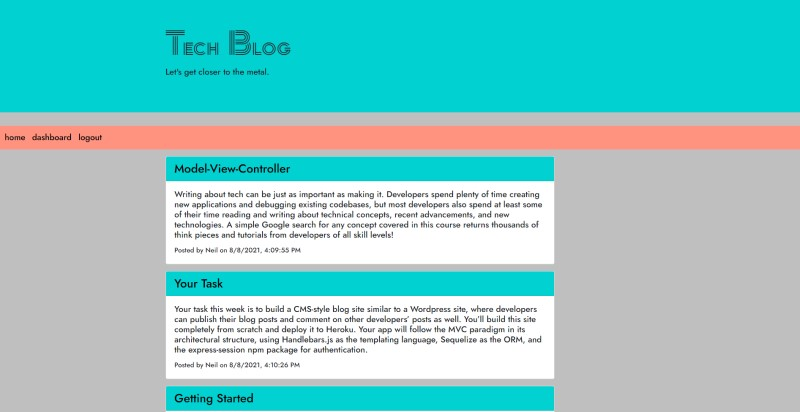
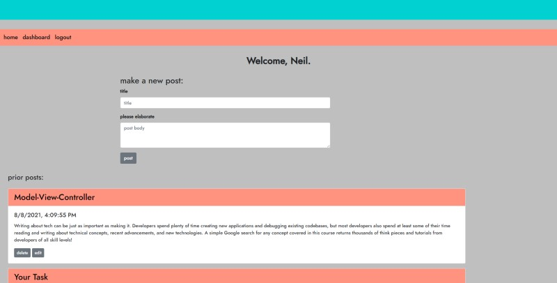
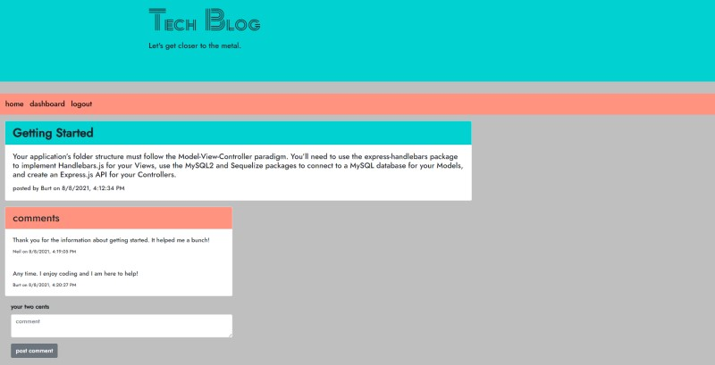

# Tech Blog  
  
## Description  
  
This is a web app that utilizes MySQL, Handlebars, and several other Node.js packages to deliver an interactive blog experience.  
  
## Table of Contents  
- ### [Installation](#installation)
- ### [Usage](#usage)
- ### [Screenshots](#screenshots)
- ### [Contributing](#contributing)
- ### [Questions](#questions)
  
## Installation  
  
Simply install Node.js, open the terminal, run 'npm install' and then 'npm start' from the directory command line. The local host version can then be accessed via browser at http://localhost:3001. Or just visit the link to the deployed app on Heroku in the [Usage](#usage) section below and sidestep installation altogether!  
  
## Usage  
  
A new user can click the signup link and create an account and existing users just need to log in to be forwarded to their dashboard page. If not logged-in or registered, a user can still view the blog posts from the homepage. New user or otherwise, once they're logged-in, they can add a post or comment on an existing one. The user may also update or delete their own posts by clicking the corresponding buttons found below each on their dashboard page.  
  
Check out the [deployed app](https://stormy-crag-19904.herokuapp.com/) at Heroku.  
  
## Screenshots  
  
  
---  
  
  
  
---  
  
  
  
## Contributing  
  
Neil Burt  
  
## Questions  
  
If you have any additional questions:  
  
Visit my [GitHub profile](https://github.com/neilburt).  
  
Or you can [email me](mailto:neil.burt@comcast.net).